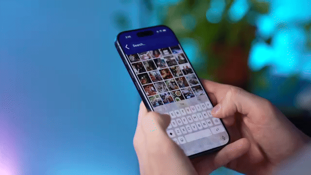

# Software Mansion React Native Labs - SWM Photos

  
  
  

## A React Native demo project replicating images gallery app behavior known from [Apple Photos](https://apps.apple.com/us/app/photos/id1584215428) or [Google Photos](https://play.google.com/store/apps/details?id=com.google.android.apps.photos&pli=1)

This repository is given to you in chapters, each chapter being hosted on a different branch:

1. [Building Apple & Google Photos Clone in React Native #1 : image list](https://github.com/software-mansion-labs/swm-react-native-labs-swm-photos/tree/episode-1)
2. [Building Apple & Google Photos Clone in React Native #2 : multiplatform](https://github.com/software-mansion-labs/swm-react-native-labs-swm-photos/tree/episode-2)
3. [Building Apple & Google Photos Clone in React Native #3 : Vega SDK](https://github.com/software-mansion-labs/swm-react-native-labs-swm-photos/tree/episode-3)
4. [Building Apple & Google Photos Clone in React Native #4 : on-device image semantic search](https://github.com/software-mansion-labs/swm-react-native-labs-swm-photos/tree/episode-4)

## Project structure

<pre>
.
├── <a href="./scripts">scripts/</a> # utility scripts for the project
├── <a href="./vega">vega/</a> # a subdirectory for Vega build
├── <a href="./assets">assets/</a> # static assets used in the app (images and fonts)
├── <a href="./src">src/</a> # mobile application source code
│   ├── <a href="./src/app">app/</a> # app routing
│   │   ├── <a href="./src/app/index.tsx">index.tsx</a> # Main app entry point
│   │   ├── <a href="./src/app/photo.tsx">photo.tsx</a> # Single Photo preview screen
│   │   └── <a href="./src/app/settings.tsx">settings.tsx</a> # App settings screen
│   ├── <a href="./src/components">components/</a> # reusable components
│   ├── <a href="./src/config">config/</a> # Configuration files
│   ├── <a href="./src/controller">controller/</a> # State machine and state network for managing app state
│   ├── <a href="./src/hooks">hooks/</a> # Custom React hooks
│   ├── <a href="./src/providers">providers/</a> # app-wide state and data providers
│   │   ├── <a href="./src/providers/CachedPhotosProvider">CachedPhotosProvider/</a> # Handles optimized (cached/resized) versions of photos for fast gallery rendering and efficient memory usage
│   │   ├── <a href="./src/providers/FilteredPhotosProvider">FilteredPhotosProvider/</a> # Provides semantic search functionality using on-device AI embeddings and vector search
│   │   ├── <a href="./src/providers/FocusRefProvider">FocusRefProvider/</a> # Stores and provides global references to React Native components, used mostly for focus management
│   │   ├── <a href="./src/providers/GalleryUISettingsProvider">GalleryUISettingsProvider/</a> # Manages gallery UI settings such as number of columns, image size, gaps, and offscreen rendering distance, persisting user preferences
│   │   ├── <a href="./src/providers/MediaLibraryPhotosProvider">MediaLibraryPhotosProvider/</a> # Loads and manages access to the device's photo library, including permissions and photo data
│   │   └── <a href="./src/providers/ScreenDimensionsProvider">ScreenDimensionsProvider/</a> # Provides screen dimensions and scaling information
│   └── <a href="./src/utils">utils/</a> # Utility functions and helpers
</pre>

## Running the project in `developer` mode

1. Check out the episode branch you want to focus on
2. Install dependencies using `bun install`
3. **Set up your unique bundle identifier** (required for iOS builds):
   - Copy `.env.example` to `.env`
   - Update `EXPO_BUNDLE_IDENTIFIER` with your unique identifier (e.g., `com.swmansion.photos.<SOME_SUFFIX>`)
4. Run the project using `bun android`, `bun ios`, `bun tvos`, `bun androidtv` or `bun web`
   - This command builds the `Release` version of the app on respective platform
   - Ensure you have the desired platform available on your machine (e.g. tvOS simulator or AndroidTV device)
5. (Optional) seed the device with images, see [Photos seed](#photos-seed) section
   - Ensure you have the desired platform available on your machine (either use `Xcode` to install `tvOS` simulator and `Android Studio` to install `AndroidTV` emulator or connect the physical device)

> [!NOTE]
> If you're having problem with seeing the photos that are available on the photo, please restart the app.
>
> Also, you can use the ⚙️ button to navigate to settings screen and trigger photos re-reading from the device and cache re-calculation (aka generating a mipmap for every photo).

## Running the project in `production` (aka `release`) mode

1. Use the very similar commands as for `developer`, but with `:release` suffix:
   - `bun ios:release`
   - `bun android:release`
   - `bun tvos:release`
   - `bun androidtv:release`
   - `bun web:release`

> [!NOTE]
> Running release commands will trigger native rebuild automatically, so there's no need to prebuild the native project.

## Running the project for `Vega`

1. Navigate to the **vega** subdirectory (`cd vega`)
2. Use the `vega-install.ts` script, providing target device and optional arguments (use `bun vega-install.ts` to see description):
   - `bun vega-install.ts device=<DEVICE_NAME> [target=sim_tv_aarch64] [photos=<DIR>] [resize=false] [target-size=1920x1080] [launch=false]`

   For example: `bun vega-install.ts device=Simulator target=sim_tv_aarch64 photos=../assets/photos resize=true launch=true`.

3. (Optional) To seed the device with images, provide path to images directory via `photos` argument of `vega-install.ts` script

> [!NOTE]
> If you're having any kind of problems with loaded images, please reinstall the app using:
>
> `kepler device uninstall-app --device <DEVICE_NAME> --appName com.swmansion.photos.main`
>
> and continue with the previously mentioned installation process.

## Features

### Semantic Search

The app includes on-device semantic search functionality powered by AI embeddings. This feature allows you to search for photos using natural language queries (e.g., "sunset", "mountain", "people"). The search uses:

- **Text Embeddings**: Converts text queries into vector embeddings using on-device AI models
- **Image Embeddings**: Generates embeddings for all photos in your library
- **Vector Search**: Uses SQLite with vector extensions (`sqliteVec`) to perform similarity search
- **FilteredPhotosProvider**: Manages the search state and filtered results

The semantic search feature is available through the search interface in the gallery header. When you enter a search query, the app will filter photos based on semantic similarity to your query.

> [!NOTE]
> The first time you use semantic search, the app needs to generate embeddings for all photos, which may take some time depending on the number of photos in your library. Progress is shown during this process.

## Performance measurements

We've tested the performance using the following preset:

1. Using [`Release`](https://docs.expo.dev/guides/local-app-development/#local-app-compilation) version of the app ([React Native docs recommendation](https://reactnative.dev/docs/performance#running-in-development-mode-devtrue))
2. Set of testing devices
   1. Android Google Pixel 4a
   2. Android Google Pixel 9
   3. iPhone 13 mini
   4. iPhone 16 plus
3. Device orchestration
   1. on Android we use manual testing and adb commands
   2. on iOS we use manual gestures (there's no known way to automate this)
4. Some measurements were done via JS by storing some timestamps and calculating the average time between several runs of the same procedure.

### iOS Performance profiling

1. Build and run the app on iOS in the Release mode (`bun ios`).
2. In `Xcode` open [`Instruments`](https://developer.apple.com/tutorials/instruments)
3. We've used following ones:
   - `Allocations` - for memory measurements
   - `Time Profiler` - for CPU measurements

### Android Performance profiling

1. Build and run the app on Android in the Release mode (`bun android`).
2. In `Android Studio` open [`Profiler`](https://developer.android.com/studio/profile).
3. We've used following ones:
   - `View Live Telemetry` - for memory and CPU measurements.

## Photos seed

### Unsplash images

Images we use to demonstrate the application are fetched from [Unsplash](https://unsplash.com/).
Several images are available in the repository and could be treated a seed for a photos gallery:

- https://unsplash.com/photos/foggy-mountain-summit-1Z2niiBPg5A
- https://unsplash.com/photos/gray-concrete-bridge-and-waterfalls-during-daytime-cssvEZacHvQ
- https://unsplash.com/photos/aerial-photo-of-seashore-sLAk1guBG90
- https://unsplash.com/photos/ocean-wave-at-beach-GyDktTa0Nmw
- https://unsplash.com/photos/forest-heat-by-sunbeam-RwHv7LgeC7s
- https://unsplash.com/photos/landscape-photo-of-mountain-alps-vddccTqwal8
- https://unsplash.com/photos/body-of-water-surrounding-with-trees-_LuLiJc1cdo

You can use them to populate your device or simulator with number of photos.
Follow [./scripts/populate-device-with-images](./scripts/populate-device-with-images.ts) to do so.

### COCO datasets

Alternatively you can download a predefined dataset.
For Semantic Search feature we've used [`val2017` dataset (5k various images)](http://images.cocodataset.org/zips/val2017.zip).
You can search for more on [cocodataset.org website.](https://cocodataset.org/#download)

## [License](LICENSE)

SWM Photos is licensed under [The MIT License](LICENSE).

## [Community Discord](https://discord.swmansion.com)

[Join the Software Mansion Community Discord](https://discord.swmansion.com) to chat about SWM Photos and other Software Mansion solutions.

## SWM Photos is created by [Software Mansion](https://swmansion.com)

Since 2012 [Software Mansion](https://swmansion.com) is a software agency with experience in building web and mobile apps. We are Core React Native Contributors and experts in dealing with all kinds of React Native issues. We can help you build your next dream product – [Hire us](https://swmansion.com/contact/projects?utm_source=swm_photos&utm_medium=readme).
